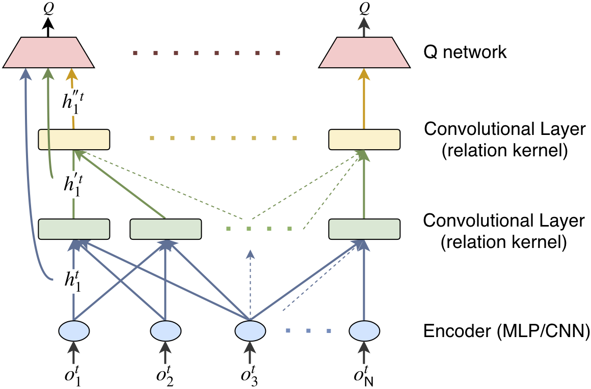

# DGN

Written by Jiechuan Jiang and Zongqing Lu

**Peking University**.

### Table of Contents
1. [Introduction](#introduction)
2. [Dependencies](#dependencies)
3. [Applications](#applications)
4. [Issues](#issues)
5. [Citation](#citation)

### Introduction

DGN is graph convolutional reinforcement learning, where the multi-agent environment is modeled as a graph, each agent is a node, and the encoding of local observation of agent is the feature of node. We apply convolution to the graph of agents. By employing multi-head attention as the convolution kernel, graph convolution is able to extract the relation representation between nodes and convolve the features from neighboring nodes just like a neuron in a convolutional neural network (CNN). Latent features extracted from gradually increased receptive fields are exploited to learn cooperative policies. Moreover, the relation representation is temporally regularized to help the agent develop consistent cooperative policy.



The codes are the implementations of DGN in the three scenarios, i.e., Jungle, Battle and Routing, presented in the paper
[Graph Convolution Reinforcement Learning](https://arxiv.org/abs/1810.09202)

In DGN, all agents share weights for the modules. The main reason is that agents use relation kernels to extract their relations based the encodings of their observations. If the encoders are different (agents encodes the observation in different ways), the relation kernels can hardly learn to extract their relations since the graph of agents is highly dynamic. 

Another very important benefit comes from parameter-sharing among agents is **DGN can naturally avoid non-stationarity.** From the optimization point of view, DGN optimizes a set of parameters for N objectives, one objective for each agent. As illustrated in the figure above, DGN as a whole can be seen as taking all the observations as input and outputting actions for all the agents, and thus DGN implicitly avoids the non-stationarity. 


### Dependencies

Install dependencies using pip.

```shell
python -m pip install -r requirements.txt
```


### Applications

DGN is simple and efficient. It empirically outperforms many state-of-art algorithms. DGN is applicable to many real applications. DGN has been applied to:
* **Traffic signal control** by researchers from Penn State ([CoLight: Learning Network-level Cooperation for Traffic Signal Control](https://arxiv.org/abs/1905.05717)). 

We expect DGN will be widely applied to many more applications. 

### Issues

*The paper ([Learning Transferable Cooperative Behavior in Multi-Agent Teams](https://arxiv.org/pdf/1906.01202.pdf)) mentions that our DGN is limited by the fixed number of agent neighbors. This is not true. DGN does not have this limitation. The fixed number came from our implementations. Our current implementations are based on TensorFlow, however, tensorFlow does not support dynamic computational graph. So, we fix the number of neighbors for each agent in these implementations. Indeed, DGN adapts to fully dynamic environments, no matter how many neighbors each agent has at a timestep and no matter how the graph of agents changes (disconnected or fully connected). We will appreciate it if anyone can implement DGN using PyTorch. Please let us know if you need any help.*

### Citation

If you are using the codes, please cite our paper.

[Jiechuan Jiang, Chen Dun, Tiejun Huang, and Zongqing Lu. *Graph convolutional reinforcement learning*. ICLR'20.](https://arxiv.org/abs/1810.09202)

	@inproceedings{jiang2020graph,
        	title={Graph Convolutional Reinforcement Learning},
        	author={Jiang, Jiechuan and Dun, Chen and Huang, Tiejun and Lu, Zongqing},
        	booktitle={ICLR},
        	year={2020}
	}

